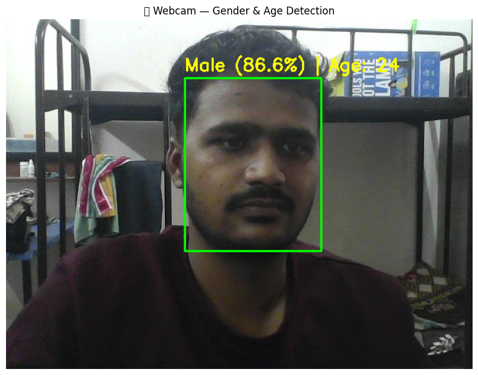
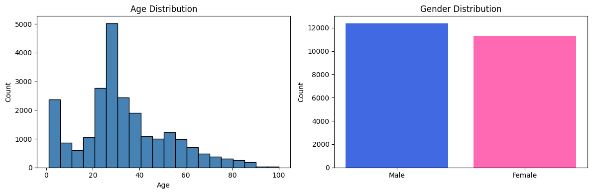
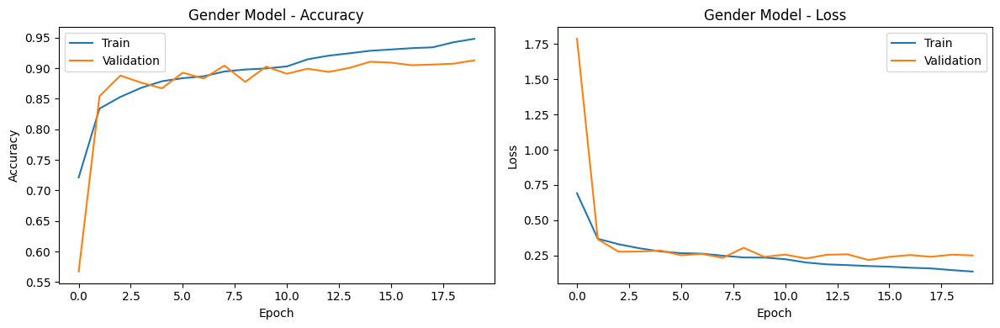
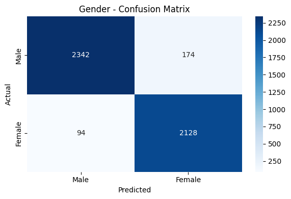
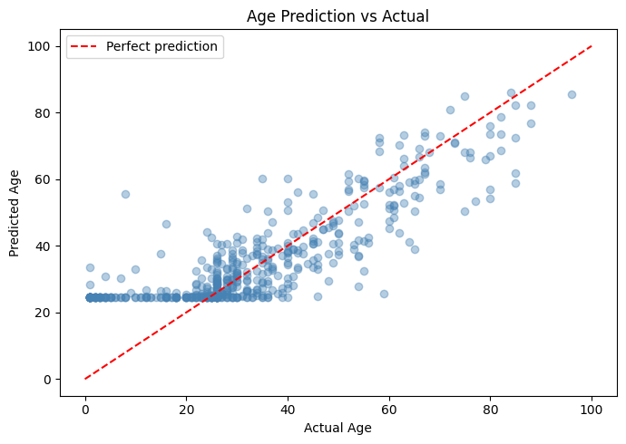

# Gender & Age Detection using Deep Learning (CNN)

Real-time gender classification and age estimation from webcam or photo input, using two custom CNNs trained on 23,687 face images and OpenCV's DNN face detector for live inference.



## Problem

Estimating gender and age from a face is a two-part problem disguised as one: gender is a clean binary classification task, while age is a continuous, much noisier target — two 25-year-olds can look 5 years apart depending on lighting, expression, and image quality. This project treats them as what they are: two separate CNNs (one classifier, one regressor) sharing the same face-detection front end, rather than forcing one model to do both.

## Approach

**Dataset**: [UTKFace](https://susanqq.github.io/UTKFace/) — 23,687 valid face images after filtering, ages 1–100 (Male: 12,386 | Female: 11,301).



**Pipeline**:
1. **Preprocessing** — faces resized to 64×64, normalized to [0,1], labels parsed from filenames
2. **Face detection** — OpenCV's pre-trained DNN face detector (`opencv_face_detector`) locates faces in any input image or webcam frame
3. **Gender model** — CNN classifier (2.24M parameters), binary cross-entropy loss
4. **Age model** — same CNN architecture adapted for regression (age normalized to [0,1], MAE loss)
5. **Live inference** — webcam capture → face detection → both models run on each detected face → bounding box + label drawn on the frame

## Results

### Gender classification — 94% test accuracy




| | Precision | Recall | F1-score | Support |
|---|---|---|---|---|
| Male | 0.96 | 0.93 | 0.95 | 2,516 |
| Female | 0.92 | 0.96 | 0.94 | 2,222 |
| **Accuracy** | | | **0.94** | 4,738 |

Best validation accuracy during training: 91.28%. Final held-out test accuracy: 94%.

### Age estimation — 8.61 years MAE overall, but uneven across age groups



| Age Group | MAE | Samples |
|---|---|---|
| Child/Teen (1–20) | 17.94 years | 946 |
| Young Adult (21–40) | **4.52 years** | 2,453 |
| Middle Age (41–60) | 8.05 years | 819 |
| Senior (61–100) | 11.78 years | 520 |

The model is genuinely accurate for young adults (21–40) but degrades sharply for children/teens and seniors. This isn't hidden in the numbers — it's a direct result of the training set skewing heavily toward the 20–30 age range (visible in the dataset distribution chart above), so the model has seen far fewer examples of very young or very old faces. The scatter plot shows this clearly: predictions cluster tightly around the diagonal for ages 20–50 and spread widely outside that range.

### Live webcam demo

The pipeline runs end-to-end on live webcam input: face detection → both CNNs → labeled output in real time (see demo image above — 86.6% gender confidence, age estimate 24).

## Tech Stack

Python · OpenCV (DNN face detection) · TensorFlow / Keras · NumPy · scikit-learn · Google Colab (training environment) · Matplotlib / Seaborn

## Repository Structure

```
├── Notebooks/
│   └── Gender-Age-Detection-Using-DL.ipynb   # Full training + inference pipeline
├── Models/
│   ├── gender_model.h5
│   ├── age_model.h5
│   ├── opencv_face_detector.pbtxt
│   ├── opencv_face_detector_uint8.pb
│   ├── y_age.npy
│   └── y_gender.npy
├──                                     # Charts used in this README
├── requirements.txt
├── .gitignore
└── README.md
```

## How to Run

```bash
git clone https://github.com/SamadhanEkad/Gender-and-Age-Detection-Using-Deep-Learning.git
cd Gender-and-Age-Detection-Using-Deep-Learning
pip install -r requirements.txt
jupyter notebook Notebooks/Gender-Age-Detection-Using-DL.ipynb
```
The notebook was built for Google Colab (uses Google Drive mounting and `google.colab.files.upload`), so running locally requires swapping those cells for local file paths.

## Limitations & Next Steps

- **Age accuracy on children and seniors is the clear weak point** — the most impactful fix would be rebalancing or augmenting the training set for underrepresented age brackets (1–20 and 61–100), rather than tuning the model further
- Gender model occasionally misclassifies at extreme ages, likely for the same data-imbalance reason
- A pretrained face-embedding backbone (e.g., FaceNet or a lightweight ResNet) instead of a CNN trained from scratch would likely improve both tasks with less data

## License

MIT
